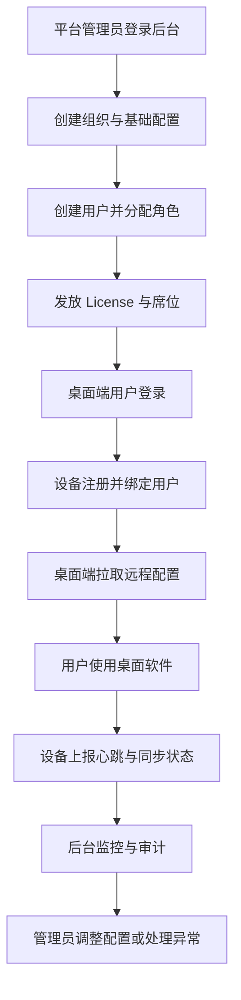

## 1. 产品概述
为 `HARNESS-AI` 增加一个中心化后台，统一管理桌面软件的用户、组织、设备、授权和系统配置，并为后续同步与审计能力预留扩展空间。
- 解决当前桌面端仅支持单机本地使用、缺少用户管理、配置下发、设备治理与运营视角的问题。
- 目标是把现有个人原型升级为可管理、可部署、可逐步走向团队化使用的产品。

## 2. 核心功能

### 2.1 用户角色
| 角色 | 注册方式 | 核心权限 |
|------|----------|----------|
| 平台超级管理员 | 后台初始化创建 | 管理全部组织、用户、配置、授权、审计 |
| 组织管理员 | 平台管理员创建 | 管理本组织用户、设备、授权、模型配置 |
| 运维人员 | 平台管理员创建 | 查看设备状态、同步任务、系统日志 |
| 桌面终端用户 | 由后台分配或邀请 | 登录桌面端、拉取配置、使用授权能力 |

### 2.2 功能模块
1. **登录与安全**：管理员登录、令牌续期、权限校验、操作身份识别。
2. **组织与用户管理**：组织创建、成员维护、角色分配、状态禁用。
3. **设备管理**：桌面端设备注册、绑定用户、查看在线状态与版本信息。
4. **授权管理**：License 套餐、席位限制、到期时间、激活状态。
5. **系统配置管理**：模型配置模板、组织级系统参数、策略开关、桌面端远程配置下发。
6. **审计与同步中心**：登录日志、配置变更日志、设备心跳、同步任务追踪。
7. **后台仪表盘**：用户数、设备数、授权状态、异常同步概览。

### 2.3 页面详情
| 页面名称 | 模块名称 | 功能描述 |
|-----------|-------------|---------------------|
| 登录页 | 账号登录 | 管理员输入账号密码登录后台，完成身份认证 |
| 仪表盘 | 数据概览 | 展示组织数、用户数、设备在线数、授权到期提醒、最近异常 |
| 组织管理页 | 组织列表 | 查看、新增、编辑组织信息，切换组织状态 |
| 用户管理页 | 用户列表 | 查看用户信息、分配组织与角色、启用禁用账号 |
| 角色权限页 | 角色配置 | 查看角色权限矩阵，配置页面与操作权限 |
| 设备管理页 | 设备列表 | 查看设备注册信息、当前状态、版本、最后在线时间 |
| 授权管理页 | License 列表 | 管理套餐、席位、有效期、启停状态 |
| 模型配置页 | 模型模板 | 维护供应商、模型名、API 地址、系统提示词 |
| 系统配置页 | 配置中心 | 管理组织级开关，如是否允许外部模型、是否允许正文上传 |
| 审计日志页 | 操作审计 | 查询用户操作日志、配置变更记录、设备关键事件 |
| 同步任务页 | 同步监控 | 查看桌面端配置拉取、心跳、同步任务状态 |

## 3. 核心流程
- 平台管理员创建组织并配置组织级后台参数。
- 管理员创建用户、分配角色、为组织发放授权与席位。
- 桌面端用户登录后，设备向后台注册并建立绑定关系。
- 桌面端按策略拉取模型配置与系统参数，并周期性上报设备心跳和同步元数据。
- 管理员在后台查看用户、设备、授权和系统状态，并对异常情况进行处理。

## 4. 用户界面设计
### 4.1 设计风格
- 主色调：深石墨灰、云白、冷蓝与少量荧光青作为状态强调色。
- 按钮风格：圆角中等、低浮雕、强调清晰层级与专业控制感。
- 字体建议：中文标题使用更有识别度的现代黑体，正文使用高可读无衬线字体。
- 布局风格：桌面优先的控制台布局，左侧导航 + 顶部全局状态栏 + 主内容区卡片/表格组合。
- 图标风格：线性图标为主，搭配少量状态徽标和趋势图。

### 4.2 页面设计概览
| 页面名称 | 模块名称 | UI 元素 |
|-----------|-------------|-------------|
| 登录页 | 登录卡片 | 大面积留白、品牌标题、状态提示、主操作按钮 |
| 仪表盘 | 概览卡片 | 数据卡、趋势条、状态标签、异常列表、快速入口 |
| 用户管理页 | 用户表格 | 搜索栏、筛选器、表格、状态徽章、抽屉表单 |
| 设备管理页 | 设备列表 | 表格、在线指示点、版本标签、详情侧栏 |
| 配置中心页 | 配置表单 | 分组卡片、输入框、开关、保存状态提示 |
| 审计日志页 | 日志检索 | 时间筛选、行为筛选、结果表格、详情面板 |

### 4.3 响应式设计
- 采用桌面优先设计，优先适配 1280px 以上管理后台使用场景。
- 在较小宽度下收起左侧导航，表格区域允许横向滚动。
- 表单、筛选器和详情抽屉保证触控板与鼠标操作都顺畅。
