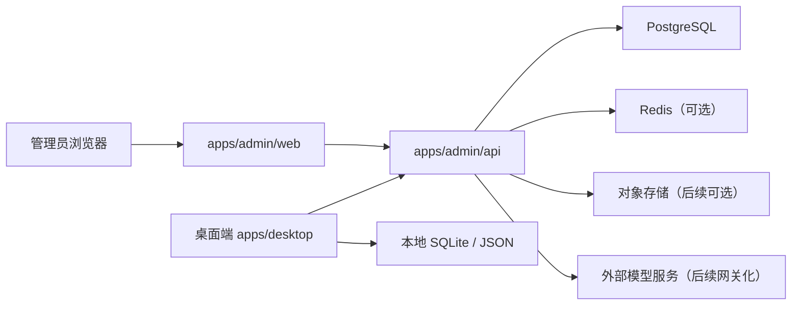
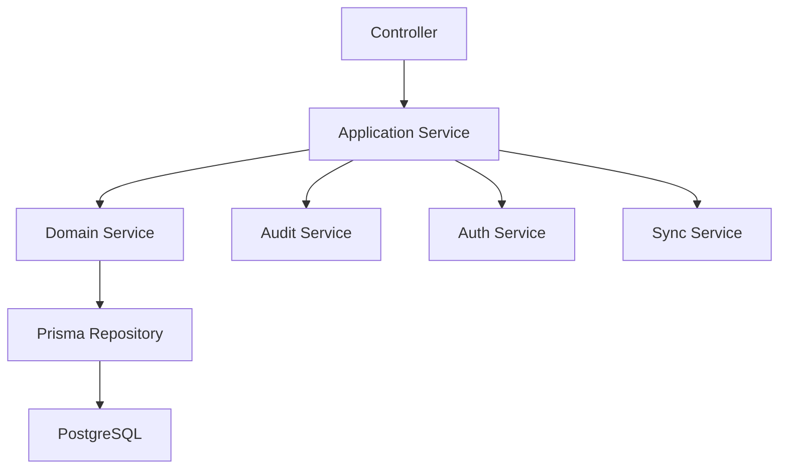
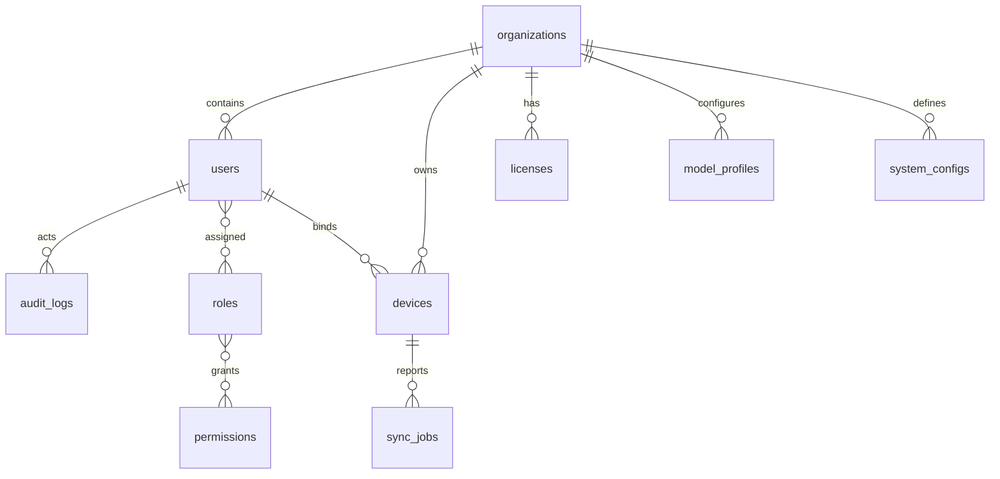

## 1. 架构设计


## 2. 技术说明
- 管理台前端：React 18 + TypeScript + Vite + Ant Design + TanStack Query + React Router
- 后台 API：NestJS 11 + TypeScript + Prisma + PostgreSQL + JWT
- 项目组织：所有后台模块统一放在 `apps/admin` 下
- 目录建议：
  - `apps/admin/api`
  - `apps/admin/web`
  - `packages/server-shared`
  - `packages/sync-sdk`
- 初始化方式：沿用当前 monorepo 的 `pnpm workspace`
- 桌面协作方式：桌面端通过 HTTPS 请求 `admin/api`，不直接访问 PostgreSQL

## 3. 路由定义
| 路由 | 用途 |
|-------|---------|
| `/login` | 管理员登录页 |
| `/dashboard` | 后台总览页 |
| `/organizations` | 组织管理 |
| `/users` | 用户管理 |
| `/roles` | 角色权限管理 |
| `/devices` | 设备管理 |
| `/licenses` | 授权管理 |
| `/model-profiles` | 模型配置管理 |
| `/system-configs` | 系统配置管理 |
| `/audit-logs` | 审计日志查询 |
| `/sync-jobs` | 同步任务监控 |

## 4. API 定义

### 4.1 TypeScript 类型定义
```ts
export type AdminUser = {
  id: string
  email: string
  name: string
  status: 'active' | 'disabled'
  organizationId?: string
  roleIds: string[]
  lastLoginAt?: string
  createdAt: string
}

export type DeviceRecord = {
  id: string
  deviceCode: string
  organizationId?: string
  userId?: string
  platform: 'windows' | 'macos' | 'linux'
  appVersion: string
  status: 'online' | 'offline' | 'blocked'
  lastSeenAt?: string
  createdAt: string
}

export type LicenseRecord = {
  id: string
  organizationId: string
  plan: string
  seatLimit: number
  expiresAt: string
  status: 'active' | 'expired' | 'disabled'
}

export type RemoteConfig = {
  id: string
  organizationId: string
  provider: string
  apiBaseUrl: string
  model: string
  systemPrompt?: string
  allowExternalModel: boolean
  allowUploadContent: boolean
  updatedAt: string
}
```

### 4.2 REST API 清单
| 方法 | 路径 | 用途 |
|------|------|------|
| `POST` | `/auth/login` | 管理员登录 |
| `POST` | `/auth/refresh` | 刷新令牌 |
| `GET` | `/auth/me` | 获取当前管理员信息 |
| `GET` | `/organizations` | 获取组织列表 |
| `POST` | `/organizations` | 创建组织 |
| `PATCH` | `/organizations/:id` | 更新组织 |
| `GET` | `/users` | 获取用户列表 |
| `POST` | `/users` | 创建用户 |
| `PATCH` | `/users/:id` | 更新用户 |
| `PATCH` | `/users/:id/status` | 更新用户状态 |
| `GET` | `/roles` | 获取角色与权限 |
| `GET` | `/devices` | 获取设备列表 |
| `POST` | `/devices/register` | 桌面端注册设备 |
| `PATCH` | `/devices/:id/bind` | 绑定设备到用户/组织 |
| `POST` | `/devices/heartbeat` | 设备上报心跳 |
| `GET` | `/licenses` | 获取授权列表 |
| `POST` | `/licenses` | 创建授权 |
| `PATCH` | `/licenses/:id` | 更新授权 |
| `GET` | `/model-profiles` | 获取模型配置模板 |
| `POST` | `/model-profiles` | 创建模型配置 |
| `PATCH` | `/model-profiles/:id` | 更新模型配置 |
| `GET` | `/system-configs` | 获取系统配置 |
| `PUT` | `/system-configs/:key` | 更新系统配置 |
| `GET` | `/audit-logs` | 查询审计日志 |
| `GET` | `/sync-jobs` | 查询同步任务 |
| `POST` | `/desktop/config/pull` | 桌面端拉取远程配置 |
| `POST` | `/desktop/sync/push` | 桌面端上报同步元数据 |

## 5. 服务端架构图


## 6. 数据模型
### 6.1 数据模型定义


### 6.2 数据定义语言
```sql
CREATE TABLE organizations (
  id UUID PRIMARY KEY,
  name VARCHAR(120) NOT NULL,
  code VARCHAR(64) NOT NULL UNIQUE,
  status VARCHAR(20) NOT NULL DEFAULT 'active',
  created_at TIMESTAMP NOT NULL DEFAULT CURRENT_TIMESTAMP,
  updated_at TIMESTAMP NOT NULL DEFAULT CURRENT_TIMESTAMP
);

CREATE TABLE users (
  id UUID PRIMARY KEY,
  organization_id UUID REFERENCES organizations(id),
  email VARCHAR(160) NOT NULL UNIQUE,
  password_hash VARCHAR(255) NOT NULL,
  name VARCHAR(120) NOT NULL,
  status VARCHAR(20) NOT NULL DEFAULT 'active',
  last_login_at TIMESTAMP NULL,
  created_at TIMESTAMP NOT NULL DEFAULT CURRENT_TIMESTAMP,
  updated_at TIMESTAMP NOT NULL DEFAULT CURRENT_TIMESTAMP
);

CREATE TABLE roles (
  id UUID PRIMARY KEY,
  code VARCHAR(64) NOT NULL UNIQUE,
  name VARCHAR(120) NOT NULL,
  scope VARCHAR(20) NOT NULL DEFAULT 'organization'
);

CREATE TABLE permissions (
  id UUID PRIMARY KEY,
  code VARCHAR(100) NOT NULL UNIQUE,
  name VARCHAR(120) NOT NULL
);

CREATE TABLE user_roles (
  user_id UUID NOT NULL REFERENCES users(id),
  role_id UUID NOT NULL REFERENCES roles(id),
  PRIMARY KEY (user_id, role_id)
);

CREATE TABLE role_permissions (
  role_id UUID NOT NULL REFERENCES roles(id),
  permission_id UUID NOT NULL REFERENCES permissions(id),
  PRIMARY KEY (role_id, permission_id)
);

CREATE TABLE devices (
  id UUID PRIMARY KEY,
  organization_id UUID REFERENCES organizations(id),
  user_id UUID REFERENCES users(id),
  device_code VARCHAR(100) NOT NULL UNIQUE,
  platform VARCHAR(20) NOT NULL,
  app_version VARCHAR(40) NOT NULL,
  status VARCHAR(20) NOT NULL DEFAULT 'offline',
  last_seen_at TIMESTAMP NULL,
  created_at TIMESTAMP NOT NULL DEFAULT CURRENT_TIMESTAMP,
  updated_at TIMESTAMP NOT NULL DEFAULT CURRENT_TIMESTAMP
);

CREATE TABLE licenses (
  id UUID PRIMARY KEY,
  organization_id UUID NOT NULL REFERENCES organizations(id),
  plan VARCHAR(80) NOT NULL,
  seat_limit INTEGER NOT NULL DEFAULT 1,
  expires_at TIMESTAMP NOT NULL,
  status VARCHAR(20) NOT NULL DEFAULT 'active',
  created_at TIMESTAMP NOT NULL DEFAULT CURRENT_TIMESTAMP,
  updated_at TIMESTAMP NOT NULL DEFAULT CURRENT_TIMESTAMP
);

CREATE TABLE model_profiles (
  id UUID PRIMARY KEY,
  organization_id UUID NOT NULL REFERENCES organizations(id),
  provider VARCHAR(80) NOT NULL,
  api_base_url VARCHAR(255) NOT NULL,
  model VARCHAR(120) NOT NULL,
  system_prompt TEXT NULL,
  enabled BOOLEAN NOT NULL DEFAULT TRUE,
  created_at TIMESTAMP NOT NULL DEFAULT CURRENT_TIMESTAMP,
  updated_at TIMESTAMP NOT NULL DEFAULT CURRENT_TIMESTAMP
);

CREATE TABLE system_configs (
  id UUID PRIMARY KEY,
  organization_id UUID NOT NULL REFERENCES organizations(id),
  config_key VARCHAR(100) NOT NULL,
  config_value JSONB NOT NULL,
  updated_by UUID REFERENCES users(id),
  created_at TIMESTAMP NOT NULL DEFAULT CURRENT_TIMESTAMP,
  updated_at TIMESTAMP NOT NULL DEFAULT CURRENT_TIMESTAMP,
  UNIQUE (organization_id, config_key)
);

CREATE TABLE audit_logs (
  id UUID PRIMARY KEY,
  actor_user_id UUID REFERENCES users(id),
  action VARCHAR(120) NOT NULL,
  target_type VARCHAR(80) NOT NULL,
  target_id VARCHAR(100) NULL,
  payload JSONB NOT NULL DEFAULT '{}'::jsonb,
  created_at TIMESTAMP NOT NULL DEFAULT CURRENT_TIMESTAMP
);

CREATE TABLE sync_jobs (
  id UUID PRIMARY KEY,
  device_id UUID NOT NULL REFERENCES devices(id),
  job_type VARCHAR(80) NOT NULL,
  status VARCHAR(20) NOT NULL DEFAULT 'pending',
  payload JSONB NOT NULL DEFAULT '{}'::jsonb,
  result JSONB NOT NULL DEFAULT '{}'::jsonb,
  created_at TIMESTAMP NOT NULL DEFAULT CURRENT_TIMESTAMP,
  updated_at TIMESTAMP NOT NULL DEFAULT CURRENT_TIMESTAMP
);

CREATE INDEX idx_users_organization_id ON users(organization_id);
CREATE INDEX idx_devices_organization_id ON devices(organization_id);
CREATE INDEX idx_devices_user_id ON devices(user_id);
CREATE INDEX idx_licenses_organization_id ON licenses(organization_id);
CREATE INDEX idx_audit_logs_actor_user_id ON audit_logs(actor_user_id);
CREATE INDEX idx_sync_jobs_device_id ON sync_jobs(device_id);
```
